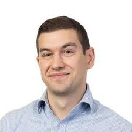
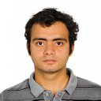
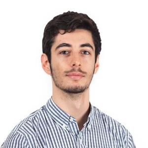
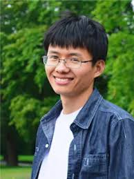
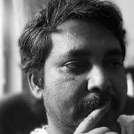
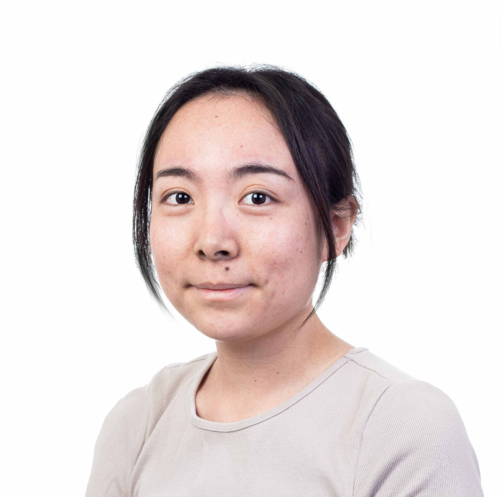

#### Wen Zhong [{width=20 height=20}](https://orcid.org/0000-0002-7422-6104) 
##### Assistant Professor, Linköping, Department of Biomedical and Clinical Sciences (BKV) 

::: {.grid}
::: {.g-col-2}
{width=80}
:::
::: {.g-col-10}
My research primarily focuses on the integration of multi-omics, the interplay between genetics and phenotypes, and the development of data-driven strategies and tools for precision medicine. 
The aim is to investigate molecular biomarkers for estimating disease risk, early disease diagnosis, stratifying drug treatment responses, monitoring disease progression, and patient stratification.
:::
:::

#### Colum Walsh [{width=20 height=20}](https://orcid.org/0000-0001-9921-7506) 
##### Professor, Linköping, Department of Biomedical and Clinical Sciences (BKV) 

::: {.grid}
::: {.g-col-2}
{width=80}
:::
::: {.g-col-10}
Colum Walsh is a Professor at the Department of Biomedical and Clinical Sciences at Linköping University. 
He is also the current director for the Clinical Genomics platform at SciLifeLab.
His research bridges molecular biology and health, with a focus that includes the epigenetic effects of nutritional interventions, disease-associated epigenetic signatures, and mental health risk factors.
:::
:::

#### Mika Gustafsson [{width=20 height=20}](https://orcid.org/0000-0002-0048-4063) 
##### Professor, Linköping, Department of Physics, Chemistry and Biology (IFM) 

::: {.grid}
::: {.g-col-2}
{width=80}
:::
::: {.g-col-10}
Professor Mika Gustafsson is a leading researcher in bioinformatics at Linköping University, specializing in translational bioinformatics and artificial intelligence. 
His work focuses on developing interpretable AI models to analyze complex biological data, aiming to enhance personalized medicine and improve understanding of disease mechanisms.
:::
:::

#### Antonio Lentini [{width=20 height=20}](https://orcid.org/0000-0003-1239-5495)
##### Assistant Professor, Linköping, Department of Biomedical and Clinical Sciences (BKV)

::: {.grid}
::: {.g-col-2}
{width=80}
:::
::: {.g-col-10}
Cancer develops over time, with different subclones acquiring new mutations that help the tumor grow and resist treatment. 
Our mission is to uncover and target the mechanisms driving tumor progression through cutting-edge single-cell and computational methods.
Ultimately, we aim to identify new therapeutic targets with the vision of improving long-term survival for cancer patients.
:::
:::

#### Vikash Pandey [{width=20 height=20}](https://orcid.org/0000-0001-5184-8149)
##### Staff scientist, Umeå, Department of Molecular Biology

::: {.grid}
::: {.g-col-2}
{width=80}
:::
::: {.g-col-10}
Vikash Pandey, a bioinformatician at Umeå University, conducts computational research on malaria parasites, focusing on genome-scale analyses and the identification of key metabolic pathways involved in transmission. 
In addition to his academic work, he is an entrepreneur who founded a cybersecurity startup as a teenager and has developed innovative tools in both the tech and bioinformatics sectors.
:::
:::

#### Alberto Zenere [{width=20 height=20}](https://orcid.org/0000-0001-5791-7686)
##### Postodoctoral researcher, Linköping, Department of Biomedical and Clinical Sciences (BKV)

::: {.grid}
::: {.g-col-2}
{width=80}
:::
::: {.g-col-10}

:::
:::

#### Xiangyu Qiao [{width=20 height=20}](https://orcid.org/0009-0007-9515-6241)
##### Postodoctoral researcher, Linköping, Department of Biomedical and Clinical Sciences (BKV) 

::: {.grid}
::: {.g-col-2}
{width=80}
:::
::: {.g-col-10}

:::
:::

#### Xiangfu Zhong [{width=20 height=20}](https://orcid.org/0000-0002-1872-1186)
##### Principal research engineer, Linköping, Department of Biomedical and Clinical Sciences (BKV) 

::: {.grid}
::: {.g-col-2}
{width=80}
:::
::: {.g-col-10}

:::
:::

#### Jyotirmoy Das [{width=20 height=20}](https://orcid.org/0000-0002-5649-4658)
##### Principal research engineer, Linköping, Department of Biomedical and Clinical Sciences (BKV) 

::: {.grid}
::: {.g-col-2}
{width=80}
:::
::: {.g-col-10}

:::
:::

#### Xingyue Wang [{width=20 height=20}](https://orcid.org/0000-0002-4960-5882)
##### PhD student, Linköping, Department of Biomedical and Clinical Sciences (BKV) 

::: {.grid}
::: {.g-col-2}
{width=80}
:::
::: {.g-col-10}

:::
:::

#### Swapnali Barde [{width=20 height=20}](https://orcid.org/0000-0003-1452-4465)
##### Postodoctoral researcher, Linköping, Department of Biomedical and Clinical Sciences (BKV) 

::: {.grid}
::: {.g-col-2}
{width=80}
:::
::: {.g-col-10}

:::
:::

